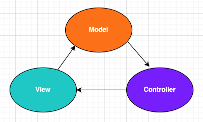
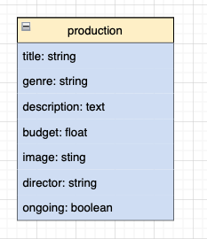

# Intro to Rails

## SWBATs

- [ ] Review MVC
- [ ] Review route writing
- [ ] Review creating a controller action
- [ ] Explain what status codes are and why we use them
- [ ] Observe how to use rails generators to accomplish certain tasks
- [ ] Observe how to create migration files and migrate using rails generators
- [ ] Observe how to seed a database
- [ ] Observe how to call Class methods in controller actions
- [ ] Observe how to structure a json response
- [ ] Observe how to return status codes

🌟 Flatiron Theater Company has hired us to build a web app. The app will have Users and Admin accounts. The theater's productions will be viewable to the general public, and users will be able to purchase tickets.

We will still use the MVC pattern to build this app:

 

To create the app we will use the following command:

```bash
rails _6.1.4_ new flatiron-theater --api --minimal` We will be working with rails 6.
```

<div id='pt3'></div>

### Rails Generators: [Cheatsheet](https://shannoncrabill.com/blog/ruby-on-rails-singular-or-plural-generator-cheat-sheet/)

<details>
  <summary>rails g controller </summary>
    <ul> 
        <li> Creates controller in app/controllers</li>
        <li> Creates a route in config/routes if actions are provided as arguments 
				 </li>
    </ul>
</details>

<details>
  <summary>rails g model</summary>
    <ul> 
        <li>Creates a model file in app/models</li>
        <li> Creates a migration file in db/migrate, will include columns and types if provided as argument</li>
    <ul>
</details>

<details>
  <summary>rails g migration</summary>
    <ul> 
        <li> Creates a migration file in db/migrate</li>
        <li> Will include columns and types if provided as argument</li>
    </ul>
</details>
  
<details>
  <summary>rails g resource</summary>
    <ul>
        <li> Creates a migration file in db/migrate</li>
        <li> Creates a model file in app/models</li>
        <li> Creates controller in app/controllers</li>
        <li> Uses the resource method for defining routes in config/routes.rb</li>
    </ul>
</details>

<br>

create a migration model and controller for production   

   


In seeds.rb:

```rb
p1 = Production.create(title: 'Hamlet', genre: 'Drama', director:'Bill Shakespeare', description:'The Tragedy of Hamlet, Prince of Denmark', budget: 100000.00, image:'https://upload.wikimedia.org/wikipedia/commons/6/6a/Edwin_Booth_Hamlet_1870.jpg', ongoing:true)

p2 = Production.create(title: 'Cats', genre: 'Musical', director:'Andrew Lloyd Webber', description:' Jellicles cats sing and dance', budget: 200000.00, image:'https://upload.wikimedia.org/wikipedia/en/3/3e/CatsMusicalLogo.jpg', ongoing:true)


p3 = Production.create(title: 'Carmen', genre: 'Opera', director:'Georges Bizet', description:'Set in southern Spain this is the story of the downfall of Don José, a naïve soldier who is seduced by the wiles of the fiery and beautiful Carmen.', budget: 200000.00, image:'https://upload.wikimedia.org/wikipedia/commons/thumb/d/d4/Prudent-Louis_Leray_-_Poster_for_the_premi%C3%A8re_of_Georges_Bizet%27s_Carmen.jpg/300px-Prudent-Louis_Leray_-_Poster_for_the_premi%C3%A8re_of_Georges_Bizet%27s_Carmen.jpg', ongoing:false)

p4 = Production.create(title: 'Hamilton', genre: 'Musical', director:'Lin-Manuel Miranda', description:'An American Musical is a sung-and-rapped-through musical by Lin-Manuel Miranda. It tells the story of American Founding Father Alexander Hamilton.', budget: 400000.00, image:'https://upload.wikimedia.org/wikipedia/en/thumb/8/83/Hamilton-poster.jpg/220px-Hamilton-poster.jpg', ongoing:false)
```

Now lets create a route that will return all productions

In config/routes

```rb
get "/productions", to: "productions#index"
```

In app/controllers/productions_controller.rb

```rb
class ProductionsController < ApplicationController
    def index 
        render json: Production.all, status: :ok
    end 
end
```