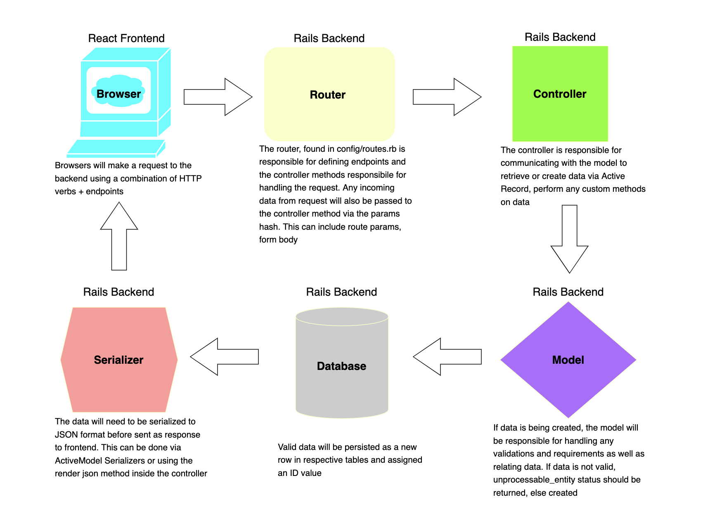

# REST
## the SWBATs
- [ ] Recognize REST patterns including route & controller naming conventions
- [ ] Review how to create routes that match controller actions
- [ ] Observe how to create routes that match custom controller actions
- [ ] Observe how to create dynamic routes
- [ ] Explain the importance of params
- [ ] Observe how to access information from params
- [ ] Observe how to use Postman to test API without a front end client
- [ ] Observe how to write exceptions in controller actions
- [ ] Explain the purpose of strong params
- [ ] Recognize strong params pattern

## Deliverables

### Frontend to Backend Request Response Flow

<p align="center">
    
</p>

### RESTful Pattern  

| HTTP Verb 	|       Path       	| Controler#Action   	|
|-----------	|:----------------:	|--------------------	|
| GET       	|   /productions   	| productions#index  	|
| GET       	| /productions/:id 	| productions#show   	|
| POST      	|   /productions   	| productions#create 	|
| PATCH/PUT 	| /productions/:id 	| productions#update 	|
| DELETE    	| /productions/:id 	| productions#delete 	|

[Rails Status codes](http://www.railsstatuscodes.com/)

Status codes we will use today:

```rb
:created # returns a 201 status code
:unprocessable_entity # returns a 422 status code
```


A few configurations before moving on:

```rb
inside config/initializers/wrap_parameters.rb

ActiveSupport.on_load(:action_controller) do
  wrap_parameters format: []
end
```

This will ensure that parameters do not get returned nested under the resource key.

<div id='pt3'></div>

### Questions to ask:

1. What HTTP verb is necessary?
2. What will the REST route look like?
3. What controller action will be responsible for handling request?

#### Handling request on back end in controller:

<div id='pt4'></div>

1. Need to permit attributes via strong params if we want to use mass assignment:

Inside ItemsController, add:

```rb

private

    def production_params 
        params.permit(:title, :genre, :director, :description, :budget, :image, :ongoing)
    end

```

### Rescuing from RecordNotFound exception:

```rb
    rescue ActiveRecord::RecordNotFound => error 
        render json: {message: error.message}
```
