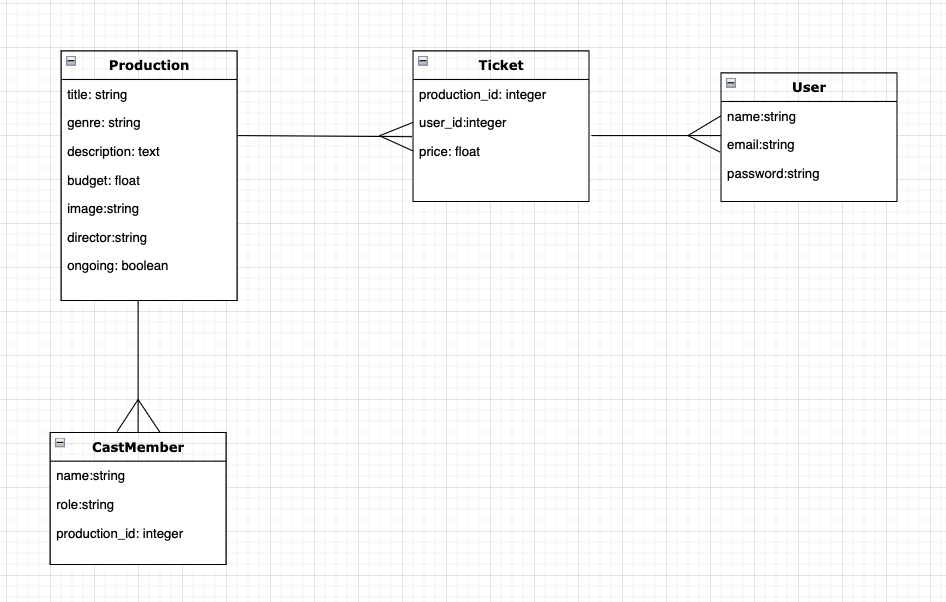

# Active Record Associations in Rails
## SWBATs:
- [ ] Observe how to use rails generators to create associations
- [ ] Observe how to create new migrations to alter existing model
- [ ] Observe how to create a new join instance from client
- [ ] Explain the purpose of serializers
- [ ] Observe how serializers are used to shape json data

Users -< Tickets > Producitons 
 

### Active Model Serializer
[Docs](https://learn.co/lessons/using-active-model-serializer)

Images:
landingPageImage
https://unsplash.com/photos/POd35V_uE4k
Published on February 16, 2018
Free to use under the Unsplash License
Dancer: Olivia Tarchick